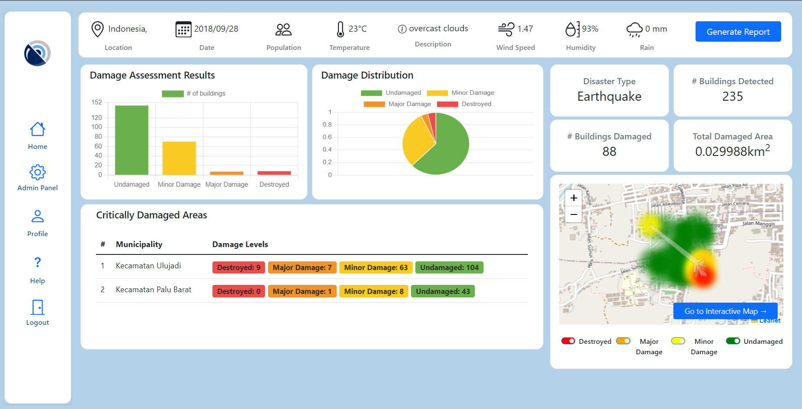

# __DisasterWatch: AI Driven Webservice for Disaster Damage Assessment__

#### Link to Static Website: [https://ayeshanaime003.github.io/DisasterWatch/](https://ayeshanaime003.github.io/DisasterWatch/)
<span style="color:red;">Note: Use username and password "dell" to view the site</span>

Dashboard:

Map:


## Summary
In the face of increasing natural disasters such as floods, wildfires, and hurricanes, real-time monitoring of affected areas is crucial for emergency response, relief coordination, and damage assessment. 

DisasterWatch simplifies disaster assessment by providing an easy-to-use platform that allows users to upload satellite imagery of affected areas. Users can see the statistic of the disaster using the dashboard and see details of the regions using the map. Powered by Django, Mapbox, and GDAL, DisasterWatch enables fast, accurate disaster response and helps authorities and communities make informed decisions during critical moments.

## Features
- Login and logout
- Regular diaster related news 
- Admin panel
- Admin Priveleges: adding, editing the role of other users and deleting users and view login history of all users
- User can change their profile
- User can view their previous dashboards
- User can upload satellite images for the segmentation model: shows dahsboard and map 

## Technologies Used
- Django
- Rasterio
- Nominatim
- SQlite
- Python

## Installation
#### 1. Clone the repository:
```bash
git clone https://github.com/AyeshaNaime003/DisasterWatch.git
```
#### 2. Create virtual environment, activate it and installl dependencies: 
```bash
python -m venv env
env/scripts/activate
pip install -r requirements
```
#### 3. Make migrations:
```bash
python manage.py migrate
```
## Usage
```bash
python manage.py runserver
```
## Awards and Honours
DisasterWatch won 2nd position in the Industry Adjudged 2024 Open House

